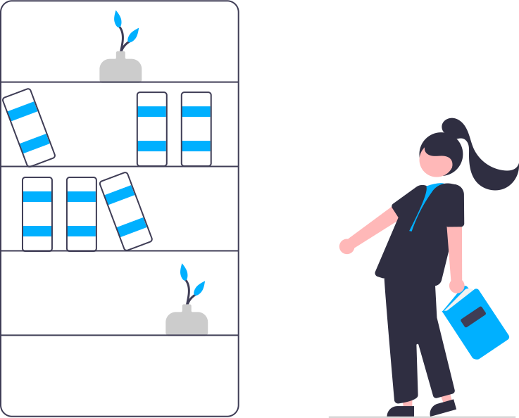

  

# Biblioteca de Provas e Materiais UCAN (Eng. Informática)

Este repositório tem o objectivo de armazenar exemplos de provas passadas e materiais, que podem ajudar os estudantes a se prepararem tais cadeiras.

## Movitos de criação

Tendo em vista que os estudantes passam por várias situações dentro do ressinto acadêmico, e andam a procura de uma busca incessante de recursos que os possam ajudar a concluir as cadeiras que fazem, recorrendo ficar atrás de colegas que têm conhecimento da matéria, colegas com materiais bons e provas de exemplos para se ter uma noção do que é esperado dele na resolução dos problemas.

Por estes e muitos outros motivos, foi decidido a criação deste repositório, cujo no qual serão alocados desde provas a materiais de apoio, listas de exercícios, links úteis e tudo que possa ajudar ou facilitar a vida do estudante dentro da academia.

## Público Alvo

Estudantes de Engenharia Informática da UCAN (Universidade Católica de Angola).

# Contribuidores

Seja um dos contribuidores e deixa o seu rosto na UCAN, ajudando os nossos queridos e lutadores colegas.

Acesse o nosso arquivo de contribuição: **[Contribuição](./CONTRIBUTING.md)**

# Estruturação do conteúdo

- 1º Ano -> <a href="1º Ano">AQUI</a>
  - 1º Semestre -> <a href="1º Ano/1º Semestre">AQUI</a>
    - Analise Matemática 1 -> <a href="1º Ano/1º Semestre/Analise Matemática 1">AQUI</a>
    - Fisica Moderna -> <a href="1º Ano/1º Semestre/">AQUI</a>
    - Fundamentos de Programação 1 -> <a href="1º Ano/1º Semestre/">AQUI</a>
    - Inglês Técnico 1 -> <a href="1º Ano/1º Semestre/">AQUI</a>
    - Sistemas Digitais 1 -> <a href="1º Ano/1º Semestre/">AQUI</a>
  - 2º Semestre -> <a href="2º Semestre">AQUI</a>
    - Analise Matemática 2 -> <a href="1º Ano/2º Semestre/">AQUI</a>
    - Fundamentos de Programação 2 -> <a href="#">AQUI</a>
    - Sistemas Operativos 2 -> <a href="#">AQUI</a>
- 2º Ano -> <a href="2º Ano">AQUI</a>
  - 1º Semestre -> <a href="2º Ano/1º Semestre">AQUI</a>
    - Analise Matemática 1 -> <a href="2º Ano/1º Semestre/Analise Matemática 1">AQUI</a>
    - Fisica Moderna -> <a href="2º Ano/1º Semestre/">AQUI</a>
    - Fundamentos de Programação 1 -> <a href="2º Ano/1º Semestre/">AQUI</a>
    - Inglês Técnico 1 -> <a href="2º Ano/1º Semestre/">AQUI</a>
    - Sistemas Digitais 1 -> <a href="2º Ano/1º Semestre/">AQUI</a>
    - Sistemas Operativos 1 -> <a href="#">AQUI</a>
  - 2º Semestre -> <a href="2º Semestr2º Ano/2º Semestre/">AQUI</a>
    - Analise Matemática 2 -> <a href="#">AQUI</a>
    - Fundamentos de Programação 2 -> <a href="#">AQUI</a>
    - Sistemas Operativos 2 -> <a href="#">AQUI</a>
- 3º Ano -> <a href="3º Ano">AQUI</a>
  - 1º Semestre -> <a href="3º Ano/1º Semestre">AQUI</a>
    - Economia e Organização de Empresas 2 3º Ano/1a>
    - Economiaº Semestre/-> <a href="2 3º Ano/1a>">AQUI</a>
    - Sistemas Inteligentes -> <a href="#">A2 3º Ano/1a>UI</a>
    - Sistemas Multimidias -> <a href="2 3º Ano/1a>">AQUI</a>
    - Base de Dados 2 -> <a href="2 3º Ano/1a>">AQUI</a>
    - Engenharia de Redes -> <a href="#">AQUI</a>
    - Computação Gráfica -> <a href="#">AQUI</a>
  - 2º Semestre -> <a href="2º Semestre">AQUI</a>
    - Bibliotecas Digitais 1 -> <a href="#">AQUI</a>
    - Sistemas Distribuidos e Paralelos 1 -> <a href="#">AQUI</a>
    - Doutrina Social da Igreja -> <a href="#">AQUI</a>
    - Comunicação por Computadores 4 -> <a href="#">AQUI</a>
    - Engenharia de Software 1 -> <a href="#">AQUI</a>
    - Comércio Electrónico -> <a href="#">AQUI</a>
- 4º Ano -> <a href="4º Ano">AQUI</a>
  - 1º Semestre -> <a href="4º Ano/1º Semestre">AQUI</a>
    - xxx
- 5º Ano -> <a href="5º Ano">AQUI</a>
  - 1º Semestre -> <a href="5º Ano/1º Semestre">AQUI</a>
    - xxx
  - 2º Semestre -> <a href="2º Semestre">AQUI</a>
    - xxx
    - xxx
    - xxx

## Contribuidores

Muito obrigado a todos os contribuidores, vocês fazem a diferença na vida de pelo menos um <b> estudante! </b>

  

## Criadores 

Criado por <a href="https://github.com/Creuma-Kuzola">Creuma Kuzola</a>  e  <a href="https://github.com/EufranioDiogo">Eufránio Diogo</a> 💻 em 4 de Agosto de 2021

